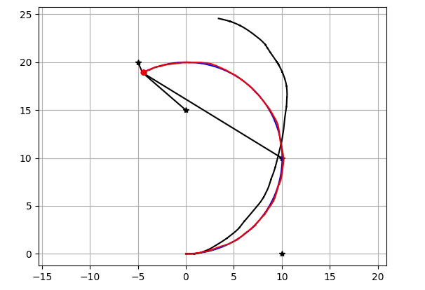
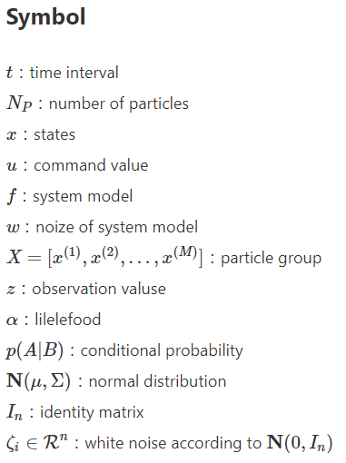
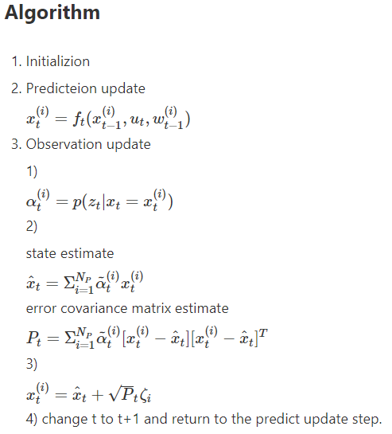

# gaussian_particle_filter  
~~~
python gaussian_particle_filter.py
~~~

## Result  

  

## Detail

  

  

## Reference  
katayama,"Non-linearity Kalman Filter",2011,p152-p155(in Japanse)  
J.H. Kotecha et al,["Gaussian particle filtering"](https://ieeexplore.ieee.org/document/1232326/versions),2003  
[PythonRobotics Particle Filter](https://github.com/AtsushiSakai/PythonRobotics/tree/master/Localization/particle_filter)  

